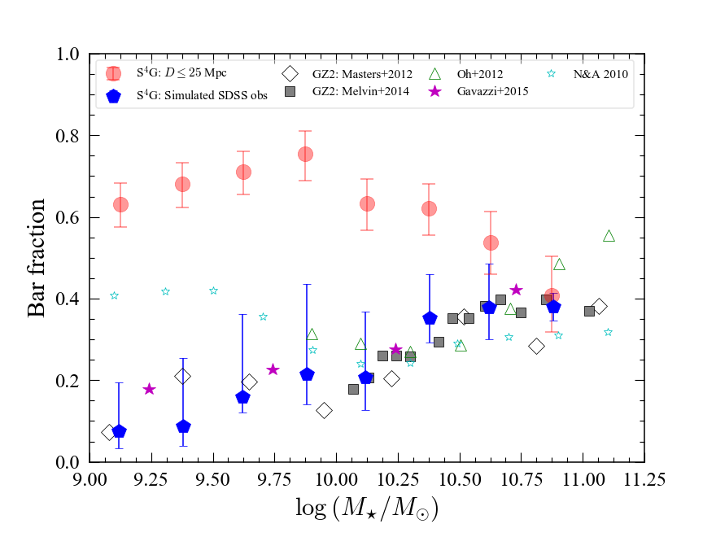

# Public data, code, and notebooks for S4G-based bar-frequencies paper using S4G data

This git repository contains data files, Python code, and Python and R Jupyter
notebooks which can be used to reproduce figures and analyses from the paper "The Dependence of Bar Frequency 
on Galaxy Mass, Colour, and Gas Content -- and Angular Resolution -- in the Local Universe"
(Erwin 2017, in prep).

A draft version of the paper can be found
[here](https://www.mpe.mpg.de/~erwin/temp/s4g_bars.pdf).

The `data/` subdirectory contains text-file tables with various data compilations
and simulation outputs; see the README.md file there for details.

## Dependencies

The Python code and notebooks require the following Python modules and packages:

   * [Numpy](https://www.numpy.org), [Scipy](https://www.scipy.org), [matplotlib](https://matplotlib.org)
   * [Astropy](https://www.astropy.org)
   * Michele Cappellari's LOESS code: [`cap_loess_1d`](http://www-astro.physics.ox.ac.uk/~mxc/software/#loess)

The R notebooks require the [survey](https://cran.r-project.org/package=survey) and
[zoo](https://cran.r-project.org/web/packages/zoo/index.html) packages.

## Jupyter Notebooks

There are three Python notebooks:

   * `s4gbars_main.ipynb` -- generates the largest set of figures in the paper; also generates
   data files for use in R logistic regression
      - Figures 1, 2, 4, 5, A1, A2, B1, B2 [currently incomplete for some of the latter figures]

   * `s4gbars_barsizes.ipynb` -- generates figures which use S4G (and sometimes Galaxy
   Zoo 2) bar *sizes*
      - Figures 3, 6, 7, 8, 9, and 11 of the paper
   
   * `s4gbars_simulated_surveys.ipynb` -- generates figures using the output of survey
   simulations (which are themselves generated by the Python script `make_simulated_surveys.py`)
      - Figures 10 and 12 of the paper
    
There are also two R notebooks:

   * `s4gbars_R_logistic_regression.ipynb` -- runs the logistic regression analyses
   used for the paper (e.g., Sections 3.1, 3.2, 3.3, and 6.1 and Table 3).

   * `s4gbars_R_quantile-loess.ipynb` -- generates text files containing quantile
   LOESS curves for bar sizes, used in Figure 8 of the paper.

## Python Code

   * `datautils.py`, `plotutils.py`, `s4gutils.py` -- miscellaneous utility functions
   (including statistics).
   
   * `simulate_surveys.py` -- code for generating bootstrapped mock surveys measuring bar frequencies,
   using the S4G galaxies as a parent sample and adopting user-specified redshift ranges.
   
   * `make_simulated_surveys.py` -- executable script generating specific mock surveys
   using the code in `simulate_surveys.py`:
      - SDSS-style bar fractions as function of stellar mass
      - SDSS-style bar fractions as function of gas mass ratio
      - HST-style bar fractions as function of stellar mass (z = 0.75)
      
      The outputs of this script (using the default random seed value of 100) can be found
      in the data/ subdirectory.
       
   * `generate_GZ2-bar-sizes_table.py` -- code for regenerating the GZ2 bar-sizes table
   in the data/ subdirectory (note that running this will required downloading the
   GZ2 SDSS metadata table from the GZ data site; see notes in the data/external/
   subdirectory).

## How to Generate Figures and Analyses from the Paper

1. Download this repository (some individual notebooks can be run with only a subset
of the data files and code, but it's simpler just to work with the entire set of files).

2. Run the Python notebooks (`s4gbars_main.ipynb`, `s4gbars_barsizes.ipynb`, `s4gbars_simulated_surveys.ipynb`)
to re-generate the figures, or to experiment with alternative versions.

3. To re-run the SDSS survey simulations, use the `make_simulated_surveys.py` script,
which will regenerate the output `sim_*` files in data/ subdirectory (using the same
random seed as was used for the paper). To change the
random seed for the simulations, edit the `make_simulated_surveys.py` script and
change the value assigned to the `randomSeed` variable; to use the current time as
the seed, set `randomSeed = None`.

4. To re-do the logistic regression analyses, run the R notebook `s4gbars_R_logistic_regression.ipynb`.
